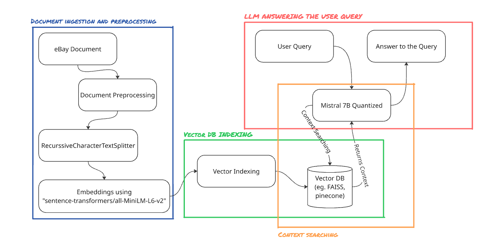

# Retrieval-Augmented Generation (RAG) Chatbot


# Project Architecture and Flow




# Overview
This project implements a Streamlit-based Retrieval-Augmented Generation (RAG) system that allows users to query information grounded in a specific document (e.g., eBay User Agreement). It combines FAISS vector search, SentenceTransformers embeddings, and a quantized Mistral-7B model via Hugging Face for fast and accurate answers.


# Steps to Run

```bash 
git clone https://github.com/aryansuri42/amlgolabs-assignment.git
cd amlgolabs-assignment
pip install -r requirements.txt
```

Chunks the text into manageable segments for embedding.

2. Create Embeddings and Build Vector DB
bash
Copy
Edit
python src/vector_searching.py
Uses the SentenceTransformer model to embed the text chunks.

Stores the embeddings into a FAISS vector database.

3. Load the RAG Pipeline
bash
Copy
Edit
python src/rag_pipeline.py
Builds the retrieval pipeline using FAISS and Hugging Face Transformers.

Defines the prompt template and LLMChain.

Running the Chatbot with Streaming
bash
Copy
Edit
streamlit run app.py
Enter your question in the input box.

The system will retrieve the top relevant document chunks and generate an answer using the LLM.

The context retrieved will also be displayed for transparency.

Model and Embedding Choices
Component	Choice	Justification
Embedding Model	all-mpnet-base-v2	Strong semantic similarity, widely used for dense vector search
LLM	mistralai/Mistral-7B-Instruct-v0.1	Instruction-tuned, quantized for low memory footprint
Vector Store	FAISS	Fast and scalable similarity search on dense vectors
Chunking Method	RecursiveCharacterTextSplitter	Ensures semantic coherence and overlap for better context recall

Sample Queries and Outputs
Query Example
vbnet
Copy
Edit
What is eBay's policy on returns?
Output Example
vbnet
Copy
Edit
eBay allows sellers to specify their return policy in listings. However, all sellers must comply with eBay's Money Back Guarantee which ensures buyers can return items not received or not as described, within a specific time frame.
Context Example
kotlin
Copy
Edit
eBay’s Money Back Guarantee ensures buyers can return items not as described. The seller may specif